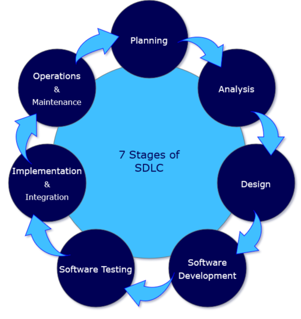
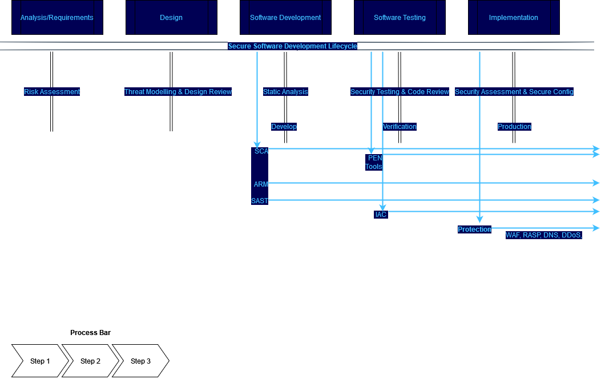

# SDLC
Software Development Lifecycle

## 📜 Table of Contents
- [What is the software development life cycle](#-What-is-the-software-development-life-cycle)
- [Stages and Best Practices](#Stages-and-Best-Practices)
    * [1. Planing](#1-Planing)
    * [2. Analysis](#2-Analysis)
    * [3. Design](#3-Design)
    * [4. Software Development Stage](#4-Software-Development-Stage)
    * [5. Software Testing Stage](#5-Software-Testing-Stage)
    * [6. Implementation & Integration](#6.Implementation-&-Integration)
    * [6. Operations & Maintenance](#6-Operations-&-Maintenance)
- [Different Models](#Different-Models)
    * [1. Waterfall Model](#1-Waterfall-Model)
    * [2. Iterative Model](#2-Iterative-Model)
    * [3. Spiral Model](#3-Spiral-Model)
    * [4. V-Model](#4-V-Model)
    * [5. Big Bang Model](#5-Big-Bang-Model)
    * [6. Agile Model](#6-Agile-Model)
- [Benefits of the SDLC](#Benefits-of-the-SDLC)
- [Where is SDLC Used](#Where-is-SDLC-Used)
- [What SDLC Model is Best](#What-SDLC-Model-is-Best)
- [What does AppSec SSDLC look like](#What-Does-AppSec-SSDLC-Look-Like)
- [The Benefits of SSDLC](#The-Benefits-of-SSDLC)

# Overview
The Software Development Life Cycle (SDLC) refers to a methodology with clearly defined processes which outlines, design, develop, test, and eventually deploy information systems or software products with greater regularity, efficiency, and overall quality.

### What is the software development life cycle
A system development life cycle or SDLC is essentially a project management model. It defines different stages that are necessary to bring a project from its initial idea or conception all the way through to deployment in production and later maintenance.

There are 7 primary stages of the modern system development life cycle, and we look at each stage individually.

### Stages and Best Practices
 1. #### Planing
The planning stage (also called the feasibility stage) is exactly what it sounds like: the phase in which developers will plan for the upcoming project.

It helps to define the problem and scope of any existing systems, as well as determine the objectives for their new systems.

By developing an effective outline for the upcoming development cycle, they'll theoretically catch problems before they affect development.

And help to secure the funding and resources they need to make their plan happen.

Perhaps most importantly, the planning stage sets the project schedule, which can be of key importance if development is for a commercial product that must be sent to market by a certain time.

2.  #### Analysis
The analysis stage includes gathering all the specific details required for a new system as well as determining the first ideas for prototypes.

Developers may:

 -  Define any prototype system requirements
 -  Evaluate alternatives to existing prototypes
 -  Perform research and analysis to determine the needs of end-users

Furthermore, developers will often create a software requirement specification or SRS document.

This includes all the specifications for software, hardware, and network requirements for the system they plan to build. This will prevent them from overdrawing funding or resources when working at the same place as other development teams.

3.  #### Design
The design stage is a necessary precursor to the main developer stage.

Developers will first outline the details for the overall application, alongside specific aspects, such as its:

 -  User interfaces
 -  System interfaces
 -  Network and network requirements
 -  Databases

They’ll typically turn the SRS document they created into a more logical structure that can later be implemented in a programming language. Operation, training, and maintenance plans will all be drawn up so that developers know what they need to do throughout every stage of the cycle moving forward.

Once complete, development managers will prepare a design document to be referenced throughout the next phases of the SDLC.

4.  #### Software Development Stage
The development stage is the part where developers actually write code and build the application according to the earlier design documents and outlined specifications.

This is where Static Application Security Testing or SAST tools come into play.

Product program code is built per the design document specifications. In theory, all of the prior planning and outlined should make the actual development phase relatively straightforward.

Developers will follow any coding guidelines as defined by the organization and utilize different tools such as compilers, debuggers, and interpreters.

Programming languages can include staples such as C++, PHP, and more. Developers will choose the right programming code to use based on the project specifications and requirements.

5.  #### Software Testing Stage
Building software is not the end unfortunately.

Now it must be tested to make sure that there aren’t any bugs and that the end-user experience will not negatively be affected at any point.

During the testing stage, developers should be going over their software with a fine-tooth comb, noting any bugs or defects that need to be tracked, fixed, and later retested. DAST Tools can be a vital component here.

It’s important that the software overall ends up meeting the quality standards that were previously defined in the SRS document.

Depending on the skill of the developers, the complexity of the software, and the requirements for the end-user, testing can either be an extremely short phase or take a very long time.

6. #### Implementation & Integration
After testing, the overall design for the software will come together. Different modules or designs will be integrated into the primary source code through developer efforts, usually by leveraging training environments to detect further errors or defects.

The information system will be integrated into its environment and eventually installed. After passing this stage, the software is theoretically ready for market and may be provided to any end-users.

7. #### Operations & Maintenance
Once again the SDLC doesn’t end when software reaches the market. Developers must now move into a maintenance mode and begin practicing any activities required to handle issues reported by end-users.

Furthermore, developers are responsible for implementing any changes that the software might need after deployment.

This can include handling residual bugs that were not able to be patched before launch or resolving new issues that crop up due to user reports. Larger systems may require longer maintenance stages compared to smaller systems.
    
Although the system development life cycle is a project management model in the broad sense, six more specific methodologies can be leveraged to achieve specific results or provide the greater SDLC with different attributes.

### Different Models
1. #### Waterfall Model
- The waterfall model is the oldest of all SDLC methodologies. It’s linear and straightforward and requires development teams to finish one phase of the project completely before moving on to the next.
- Each stage has a separate project plan and takes information from the previous stage to avoid similar issues (if encountered). However, it is vulnerable to early delays and can lead to big problems arising for development teams later down the road.

2. #### Iterative Model
- The iterative model focuses on repetition and repeat testing. New versions of a software project are produced at the end of each phase to catch potential errors and allow developers to constantly improve the end product by the time it is ready for market.
- One of the upsides to this model is that developers can create a working version of the project relatively early in their development life cycle, so implement the changes are often less expensive.

3. #### Spiral Model
- Spiral models are flexible compared to other methodologies. Projects pass through four main phases again and again in a metaphorically spiral motion.
- It’s advantageous for large projects since development teams can create very customized products and incorporate any received feedback relatively early in the life cycle. 

4. #### V-Model
- The V-model (which is short for verification and validation) is quite similar to the waterfall model. A testing phase is incorporated into each development stage to catch potential bugs and defects.
- It’s incredibly disciplined and requires a rigorous timeline. But in theory, it illuminates the shortcomings of the main waterfall model by preventing larger bugs from spiraling out of control.

5. #### Big Bang Model
- The Big Bang model is incredibly flexible and doesn’t follow a rigorous process or procedure. It even leaves detailed planning behind. It’s mostly used to develop broad ideas when the customer or client isn’t sure what they want. Developers simply start the project with money and resources.
- Their output may be closer or farther from what the client eventually realizes they desire. It’s mostly used for smaller projects and experimental life cycles designed to inform other projects in the same company.
6. #### Agile Model
- The agile model is relatively well-known, particularly in the software development industry.
- The agile methodology prioritizes fast and ongoing release cycles, utilizing small but incremental changes between releases. This results in more iterations and many more tests compared to other models.
- Theoretically, this model helps teams to address small issues as they arise rather than missing them until later, more complex stages of a project.

### Benefits of the SDLC
|  |  |
| :---------- | :---------- |
| Clear Goal Descriptions   | Developers clearly know the goals they need to meet and the deliverables they must achieve by a set timeline, lowering the risk of time and resources being wasted.|
| Proper Testing Before Installation | SDLC models implement checks and balances to ensure that all software is tested before being installed in greater source code.|
| Clear Stage Progression | Developers can’t move on to the next age until the prior one is completed and signed off by a manager.|
| Member Flexibility  | Since SDLCs have well-structured documents for project goals and methodologies, team members can leave and be replaced by new members relatively painlessly. |
| Perfection Is Achievable    | All SDLC stages are meant to feed back into one another. SDLC models can therefore help projects to iterate and improve upon themselves over and over until essentially perfect.|
| No One Member Makes or Breaks the Project   | Again, since SDLCs utilize extensive paperwork and guideline documents, it’s a team effort and losing one even major member will not jeopardize the project timeline.|

### Where is SDLC Used
- System development life cycles are typically used when developing IT projects.
- Software development managers will utilize SDLCs to outline various development stages,  make sure everyone completes stages on time and in the correct order, and that the project is delivered as promptly and as bug-free as possible.
- SDLCs can also be more specifically used by systems analysts as they develop and later implement a new information system.

### What SDLC Model is Best
- It largely depends on what your team’s goals and resource requirements are.
- Most IT development teams utilize the agile methodology for their SDLC. However, others may prefer the iterative or spiral methodologies.
- All three of these methods are popular since they allow for extensive iteration and bug testing before a product is integrated with greater source code or delivered to market.
- DevOps methodologies are also popular choices. And if you ever need a refresher course on what DevOps is, you needn't worry as our team at Datacom have you covered!

### What does AppSec SSDLC look like
- Datacom’s objective is to ensure that secure software development and design principles are implemented and tested early and during all development stages. This approach allows Datacom to minimize the attack surface area whilst establishing security measures by default and applying the principle of “defense in depth”.

### The Benefits of SSDLC
- Secure SDLC is the ultimate example of what’s known as a “shift-left” initiative, which refers to integrating security checks as early in the SDLC as possible.
- Doing so helps development teams properly plan releases, making it easier to catch and address issues that arise that could affect the release timeline. This is most certainly preferable to receiving an unpleasant surprise once the application deploys to production. SSDLC, therefore, helps keep releases on track.
- What’s more, SSDLC at its core has the security efforts being led by the development team itself. This allows the issues to be fixed by the domain experts who wrote the software rather than having a different team fix the bugs as an afterthought. This empowers developers to take ownership of the overall quality of their applications, which leads to more secure applications being deployed to production.
- While all the extra effort of security testing within the SDLC process may sound like a lot of work and expensive to build, today, most of it is being automated. 
- By fixing these issues early in the process, development teams can reduce the total cost of ownership of their applications. Discovering issues late in the SDLC can result in a 100-fold increase in the development cost needed to fix those issues.
